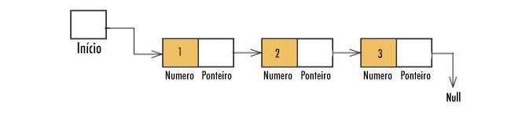

<h1>Algoritmos - C103</h1>

<h3>Segunda prova</h3>

* Conceitos básicos de lógica
  * Iterações e trabalhos com loops
  * Lógicas de teste e teste de mesa
* Ordenações & Hashing
  * QuickSort()
* Ponteiros
  * Conceito & aplicações
* Listas ligadas
  * Stack
    * *Saí quem entrou por último*
  * Queue
    * *Quem entra primeiro saí primeiro*
* Grafos

---

<h4>Ponteiros</h4>

`Conteudo da variavel -> var `

`Endereço da variavel -> &var`

`Conteudo da variavel ponteiro ptr:`

```
int *ponteiro;

ponteiro = &var

cout << ponteiro << endl; // saída: endereço de memória em hexadecimal

cout << *ponteiro << endl; // saída: valor de var (numero inteiro qualquer)
```

---

<h4>Listas Ligadas</h4>



<h5>Queue - Fila</h5>

Ao iterar uma Queue, o resultado seguirá a ordem em que os elementos dela foram adicionados.

```
fila.push_back(valor) // add valor no final da fila
fila.push_back(outro_valor) // add outro_valor no final da fila

fila.pop_front() // remove valor da fila 
fila.pop_front() // remove outro_valor da fila
```

*Entra por último e saí por último*

<h5>Stack - Pilha</h5>

Ao iterar uma Stack, os elementos serão retornados em ordem inversa à que foram inseridos.

```
pilha.push_front(valor)
pilha.push_front(outro_valor)

pilha.pop_front() // remove outro_valor da pilha
pilha.pop_front() // remove valor da pilha
```

*Famoso corta fila, entrou depois de todo mundo e vai sair na frente*

---

<h3>Grafos</h3>

Entender sobre conceitos de Grafos e tipos.

<h6>Busca em largura e distâncias</h6>

**BFS**

<h6>Busca em profundidade</h6>

**DFS**

<h5>DIJKSTRA</h5>
